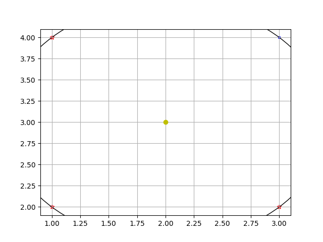

# Computational geometry

Solved problems:
- minimum_disk_check;
- polygon_monotonicity_check (direction given).

## Install and Build
```shell
python -m venv venv
pip install -r requirements.txt
```

In `config.json` you can change visualisation and tolerance:
```json
{
  "visualisation": "true",
  "tolerance": "1e-9"
}
```

## minimum_disk_check
```shell
cd app
python manage.py minimum_disk_check ./res/mindisc ./res/mindisc
```

Example:
- `input_points.txt` - points of set
  ```txt
  1.0 5.0
  2.0 3.0
  3.0 2.0
  3.0 4.0
  1.0 2.0
  ```
- `input_indexes.txt` - indexes of points
  ```txt
  # comment
  empty
  0
  0 1
  # min_disc
  0 2
  # line
  4 1 3
  # min_disc
  0 2 4
  ```
- `output.txt` - result for every indexes
  ```txt
  [] - False
  [0] - False
  [0, 2] - True
  [4, 1, 3] - False
  [0, 2, 4] - True
  ```
- `mindisc_visual.png` - visualisation of last indexes

  

## polygon_monotonicity_check (direction given)
```shell
cd app
python manage.py polygon_monotonicity_check ./res/monotonpoly ./res/monotonpoly
```

Example:
- `input_vertexes.txt` - vertexes of polygon
  ```txt
  2 2
  0 2
  1 4
  5 6
  5 4
  ```

- `input_direction.txt` - direction of polygon
  ```txt
  2 4
  ```

- `output.txt` - result
  ```txt
  True
  ```
