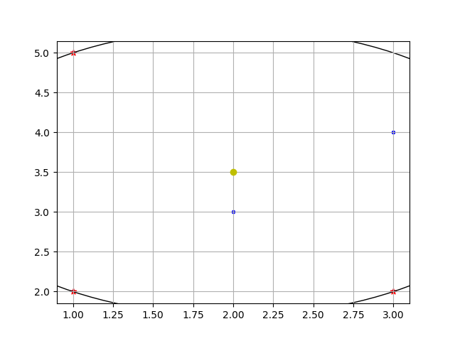

# Computational geometry

Solved problems:
- minimum_disk_check

## Install and Build
```shell
python -m venv venv
source venv/bin/activate
pip install -r requirements.txt
```

## minimum_disk_check
```shell
cd app
python manage.py minimum_disk_check ./res/mindisc ./res/mindisc True
```

Example:
- `input_points.txt` - points of set
  ```txt
  1.0 5.0
  2.0 3.0
  3.0 2.0
  3.0 4.0
  1.0 2.0
  ```
- `input_indexes.txt` - indexes of points
  ```txt
  # comment
  empty
  0
  0 1
  # min_disc
  0 2
  # line
  4 1 3
  # min_disc
  0 2 4
  ```
- `output.txt` - result for every indexes
  ```txt
  [] - False
  [0] - False
  [0, 2] - True
  [4, 1, 3] - False
  [0, 2, 4] - True
  ```
- `mindisc_visual.png` - visualisation of last indexes

  
